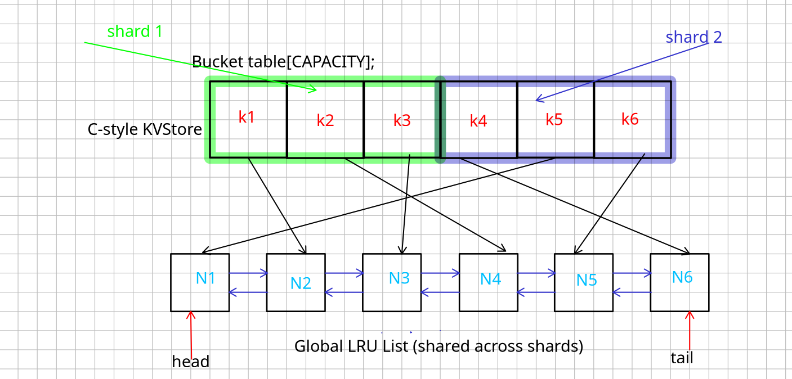

# **LRU KV Store - Design Notes**

## Architecture Diagram

* We use a fixed-size C-style array (`table[]`) with `CAPACITY` buckets (e.g., 1024).
* Each bucket stores:
    * A status flag: `Empty`, `Occupied`, or `Deleted`
    * A pointer to a Node
* All Nodes are linked via a global doubly-linked list, which tracks usage order:
    * Head = most recently used
    * Tail = least recently used

---
### **Put (Insert / Update)**
* Compute `hash = fnv1a(key)`
* Get bucket index: `idx = hash % CAPACITY`
* If the bucket is:
    * **Empty**: insert directly
    * **Occupied**:
        * If same key: update value, move node to head
        * Else: use linear probing to find next slot
* If inserting a new key and store is full (`size == CAPACITY`):
    * **Evict tail node**
    * Clear its slot and remove from linked list
* In concurrnt design It does not update LRU order to avoid locking or contention.

---

### **Get (Access)**

* Compute hash and index as above
* Use linear probing to find the key
* If found:
    * Return value

---

### **Eviction**

* Triggered only when inserting a new key and store is full
* Evict tail of LRU list (least recently used)
* Remove entry from hash table

---

### **Complexity**

* **Best case**: O(1) insert/get (ideal hash, no collision)
* **Worst case**: O(n) if hash collisions degenerate (linear probe through many buckets)

